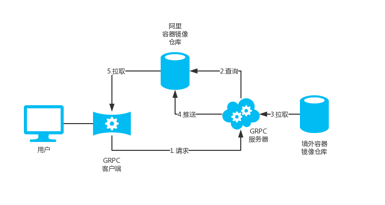

## image-pull
基于 GRPC/Python3 开发，用于拉取 k8s.gcr.io、 quay.io等境外仓库中的镜像工具。

### 工作原理

拉取存在两种情况：
- 阿里容器镜像仓库已经存在缓存，
那么直接映射镜像仓库中的容器镜像名拉取即可。
- 阿里容器镜像仓库不存在缓存，则gRPC服务器会先将容器镜像拉取至
容器镜像仓库中，接着映射镜像仓库中的容器镜像名拉取，整个过程会比较耗时。
> 设计主要考虑避免gRPC服务器针对国内带宽不稳定，存储空间不足并且尽最大努力节约gRPC服务器流量与带宽资源。
### 用法
- 通过命令行拉取指定镜像：

拉取镜像：quay.io/coreos/flannel:v0.11.0
```python
python3 pull.py \
        -i quay.io/coreos/flannel:v0.11.0 \ 
        -s mirrors.geekcloud.top
```
- 通过文件拉取指定镜像
```python
python3 pull.py \
        -f image-k8s.txt \ 
        -s mirrors.geekcloud.top
```
> image-k8s.txt (每行一个镜像名)
```text
hello-world:latest
quay.io/coreos/flannel:v0.11.0
quay.io/coreos/flannel:v0.12.0
```
### 境外服务器节点部署
- 配置
重命名`settings-example.py`文件为`settings.py`，并设置相关参数
```bash
# 仓库地址
RepoUrl = "registry.cn-hangzhou.aliyuncs.com"
# 仓库命名空间
RepoNamespace = "sp"
# 以下为阿里云镜像仓库配置参数：
# 产品名
Product_name = "cr"
# 镜像仓库所在位置
Region_id = "cn-hangzhou"
# 镜像仓库节点名
End_point = "cr.cn-hangzhou.aliyuncs.com"
# 阿里云镜像仓库 RAM 用户ID
id = "123"
# 阿里云镜像仓库 RAM 用户key
key = "666"
# 阿里云镜像仓库 RAM 用户名
username = "admin"
# 阿里云镜像仓库 RAM 密码
password = "123"
# 境外服务器工作端口
server_listen = '[::]:50051'
# 境外服务器域名或地址
host= "www.example.com"
```
- 安装依赖与部署
```shell
pip3 install -r requirements.txt
python3 server.py
```
